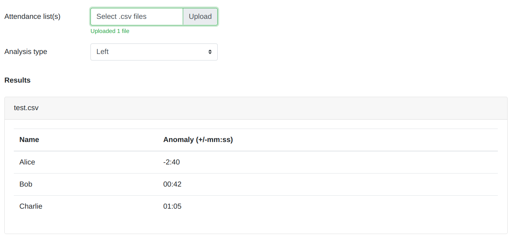

# tala-frontend

A simple and easy-to-use user interface for analyzing MS Teams attendance lists.

## Introduction

Do you have any doubts that the participants of your meetings do anything else?
Good, TALA is for you.

With TALA you can analyze MS Teams attendance lists and understand the behavior
of the participants to your meetings. I've personally used this tool in order to
understand what my students do during my meeting. Results were kinda
interesting!

## Features

- **Find joined outliers**, i.e., who joined before or after the participants mean.*

- **Find left outliers**, i.e., who left before or after the participants mean.*

- Analyze multiple lists at once

## Demo

> [🚀 Try it out!](https://tala-frontend.herokuapp.com)



## Usage

1. Install dependencies

```
yarn
```

2. Start the app

```
yarn start
```

## Related

* [CONTROLLO FURBETTI su MICROSOFT TEAMS - OUTLIERS DETECTION SYSTEM](https://www.youtube.com/watch?v=YGYGRKyoor8), a video that explains how the outlier detection system employed works. (In Italian 🇮🇹).

* [FRONTEND + BACKEND per ANALISI LISTE DI PARTECIPAZIONE MS TEAMS](https://www.youtube.com/watch?v=4VOIHLyQqyk), a video that explains TALA backend and frontend infrastructure. (In Italian 🇮🇹).

* [tala-backend](https://github.com/lparolari/tala-backend), TALA backend code.

* [tala-research](https://github.com/lparolari/ms-teams-attendance-list-analyzer),
  TALA researches for best model.

## Author

Luca Parolari

- Email: [luca.parolari23@gmail.com](mailto:luca.parolari23@gmail.com)
- GitHub: [@lparolari](https://github.com/lparolari)
- Telegram: [@lparolari](https://t.me/lparolari)

## License

MIT
